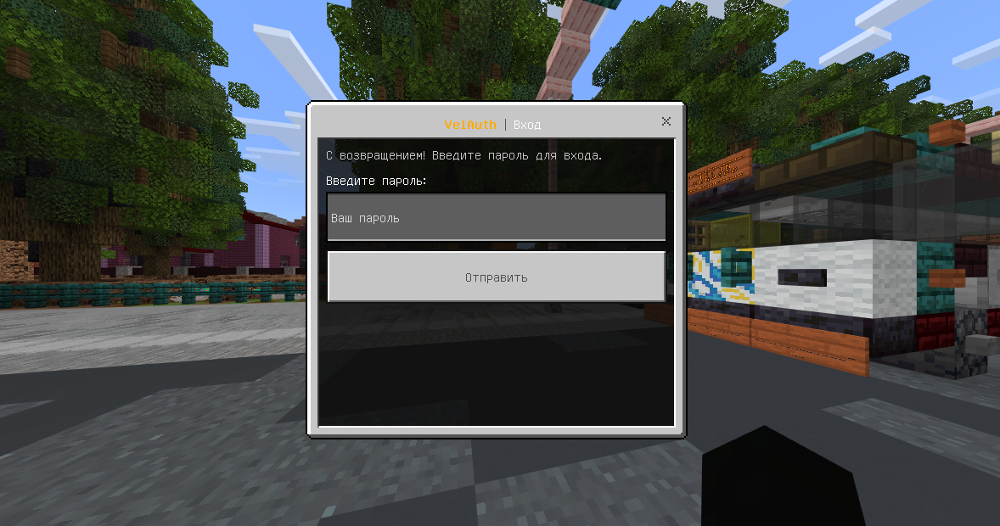

# VelAuth - Modern Authentication System

<div align="center">

[](https://github.com/pmmp/PocketMine-MP)
[](https://www.php.net/)
[](LICENSE)

**Modern authentication system for PocketMine-MP with beautiful FormAPI interface**

[Russian](#russian) | [English](#english)

</div>

---

## Russian

### Описание

**VelAuth** - современная система авторизации для PocketMine-MP с красивым интерфейсом через FormAPI и продвинутой системой безопасности.

### Особенности

**Безопасность:**
- Argon2id хеширование паролей
- Защита от брутфорса
- Система сессий с автовходом по IP
- Полная блокировка действий до авторизации

**Интерфейс:**
- Все через FormAPI - никаких команд
- Красивые формы с иконками Minecraft
- Интуитивная навигация
- Русский язык

**Функционал:**
- Регистрация через форму
- Вход через форму
- Автовход по IP (настраивается)
- Смена пароля
- Выход из аккаунта

**Админ-панель:**
- Список всех игроков
- Смена пароля любому игроку
- Просмотр IP адреса
- Поиск связанных аккаунтов по IP
- Статистика: последний вход, регистрация

### Скриншоты

<details>
<summary>Форма входа</summary>



</details>

<details>
<summary>Управление аккаунтом</summary>


</details>

<details>
<summary>Выход из аккаунта</summary>


</details>

<details>
<summary>Админ-панель</summary>


</details>

<details>
<summary>Список игроков</summary>


</details>

<details>
<summary>Информация о игроке</summary>


</details>

<details>
<summary>Связанные аккаунты</summary>


</details>

### Установка

1. Скачайте плагин
2. Установите [FormAPI](https://github.com/jojoe77777/FormAPI)
3. Поместите папку в `plugins`
4. Перезапустите сервер

### Команды

| Команда | Описание | Право |
|---------|----------|-------|
| `/auth` | Главное меню | `velauth.use` |

### Права

| Право | Описание | По умолчанию |
|-------|----------|--------------|
| `velauth.use` | Команда /auth | Все |
| `velauth.admin` | Админ-панель | Операторы |

### Конфигурация

```yaml
max-login-attempts: 3
session-duration: 604800
enable-auto-login: true
min-password-length: 6
max-password-length: 32
```

### Зависимости

- PocketMine-MP 5.0+
- FormAPI

---

## English

### Description

**VelAuth** - modern authentication system for PocketMine-MP with beautiful FormAPI interface and advanced security.

### Features

**Security:**
- Argon2id password hashing
- Brute-force protection
- Session system with auto-login by IP
- Complete action lockdown before auth

**Interface:**
- Everything through FormAPI
- Beautiful forms with Minecraft icons
- Intuitive navigation
- Localized

**Features:**
- Registration via form
- Login via form
- Auto-login by IP (configurable)
- Password change
- Account logout

**Admin Panel:**
- List all players
- Change any player password
- View player IP
- Search linked accounts by IP
- Statistics: last login, registration

### Screenshots

<details>
<summary>Login Form</summary>


</details>

<details>
<summary>Account Management</summary>


</details>

<details>
<summary>Logout</summary>


</details>

<details>
<summary>Admin Panel</summary>


</details>

<details>
<summary>Player List</summary>


</details>

<details>
<summary>Player Information</summary>


</details>

<details>
<summary>Linked Accounts</summary>


</details>

### Installation

1. Download plugin
2. Install [FormAPI](https://github.com/jojoe77777/FormAPI)
3. Place folder in `plugins`
4. Restart server

### Commands

| Command | Description | Permission |
|---------|-------------|------------|
| `/auth` | Main menu | `velauth.use` |

### Permissions

| Permission | Description | Default |
|------------|-------------|---------|
| `velauth.use` | /auth command | All |
| `velauth.admin` | Admin panel | Operators |

### Configuration

```yaml
max-login-attempts: 3
session-duration: 604800
enable-auto-login: true
min-password-length: 6
max-password-length: 32
```

### Dependencies

- PocketMine-MP 5.0+
- FormAPI

---

<div align="center">

**Made with ❤️ by [Velrow](https://github.com/Velrow)**

⭐ Star this repo if you like it!

</div>
